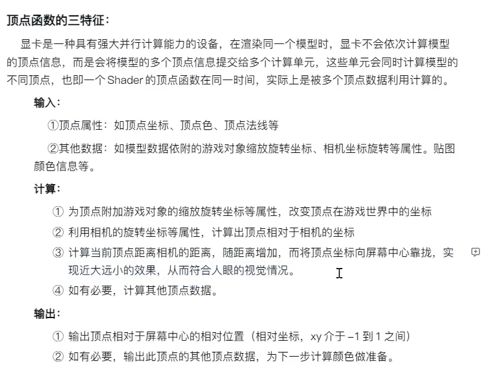
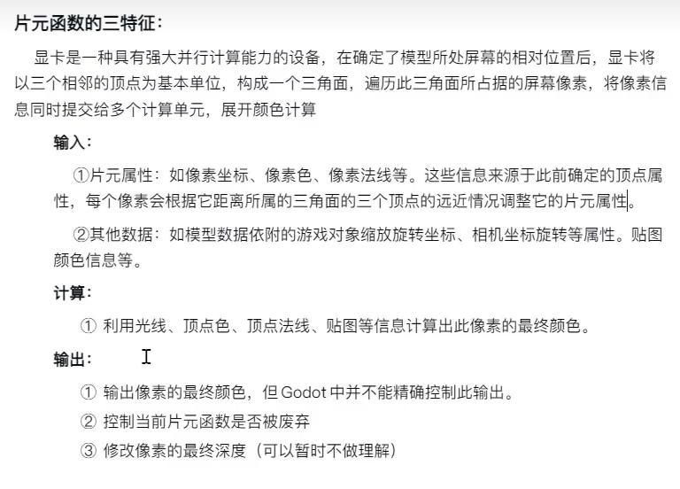

# GoDoT

>
> `GODOT4.x官方文档：https://docs.godotengine.org/zh-cn/4.x/getting_started/introduction/key_concepts_overview.html`
> ``
>
 


## 基础介绍


godot4大组成元素：scene场景 -> node节点树 -> script脚本 -> signal信号

场景`.tscn`
scene可进行嵌套（组合node、预制体）、基于scene进行组件封装

材质：Texture、Material、Shader


- 每个节点都能添加脚本、godot的脚本相当于和节点绑定的（一体）、单纯给节点扩展方法
- 全局脚本：项目设置 -> 自动加载
- @GDScript：GDScript的工具函数和类型操作、@GlobalScope：Godot引擎全局作用域；@GlobalScope下的东西可以自动导入
- 基础物理配置：RigidBody刚体 + CollisionObject碰撞体 + CollisionShape碰撞形状
- queue_free()节点销毁
- node节点分组group、类似unity中的tag标签


### 项目设置
```yaml
项目设置:
    常规:
        应用:
            配置: # 应用名称、图标
            运行: # 主场景
            启动画面: # 
        显示:
            窗口: # 视口大小、垂直同步
            鼠标光标: # 
        音频:
        国际化:
        GUI:
        渲染:
        输入设备:
        物理:
        XR:
        编辑器:
        导航:
        层名称:
        文件系统:
    输入映射:
    本地化:
    全局:
        自动加载:
        着色器全局量:
        分组:
    插件:
    默认导入设置:
```


### 编辑器设置
```yaml
编辑器设置:
    界面:
    网络:
    文件系统:
    文本编辑器:
    各编辑器:
    运行:
    调试器:
    版本控制:
    输入:
    项目管理器:
    导出:
        Android:
        MacOS:
        Windows:
```


#### godot


#### tscn


#### tres


## 核心内容
```yaml
Godot:
    @GDScript: # GDScript模块的builtins内建工具类集合
        INF:
        NAN:
        instance_from_id():
        is_instance_valid():
        load(): # 导入其他资源
        preload(): # 导入其它模块
        print_debug():
        typeof():
    @GlobalScope: # Godot引擎提供的全局命名空间：所有全局常量与全局函数
        $: # 获取node节点（根据name）
        ClassDB:
        Engine:
        Error: # 异常枚举
        GDExtensionManager:
        Input:
        InputMap:
        IP:
        OS:
        ProjectSettings:
        ThemeDB:
        Time:
        acos(): # 反余弦，弧度
        clamp(): # 值范围限定
        deg_to_rad(): # 角度转弧度
        print(): # 控制台输出
        rad_to_deg(): # 弧度转角度
        randf(): # 0~1，浮点数
        randi(): # 随机数，32位
        randi_range(): # 随机数，32位，范围
        randomize(): # 初始化随机种子
        range(): # 生成数组
        seed(): # 可重复随机种子
        str(): # 转换为字符串
        type_convert():
        typeof():
    bool:
    float:
    int: # 整数
    AABB:
    Array: # 数组
        append(): # 追加元素
        append_array():
        erase(): # 删除元素
        is_empty():
        pick_random(): # 随机获取元素
        push_back():
        push_front():
        remove_at():
        resize():
        size(): # 数组大小
        slice(): # 截取
    Basis:
    Callable: # 可调用对象
        bind():
        call():
        call_deferred():
    Color:
    Dictionary: # 字典
        clear():
        erase():
        has():
        is_empty():
        keys(): # 所有键
        size():
        values(): # 所有值
    Error: # 异常基类
    NodePath: # 场景树路径
    Object:
        _get_property_list(): # 为 游戏引擎提供自定义属性列表
        call_deferred(): # 在空闲时调用该对象的 method 方法
        connect(): # 连接信号，连接 自己的信号 到 指定方法 上
        disconnect(): # 断开 信号
        duplicate(): # 对象拷贝
        emit_signal(): # 触发信号
        free(): # 立即释放
        get_class(): # 获取类名
        get_node(): # 获取子节点
        is_connected():
        get(): # 读取 属性
        get_meta():
        get_signal_list():
        queue_free(): # 安全释放
        new(): # 实例化类
        notify_property_list_changed(): # 刷新编辑器
        set(): # 设置 属性
        set_script(): # 动态绑定脚本
        ---
        AudioServer:
        CameraServer:
        ClassDB:
        DisplayServer:
        EditorFileSystemDirectory:
        EditorInterface:
        Engine: # 游戏引擎实例
            max_fps:
            register_singleton(): # 注册单例
        GDExtensionManager: # GD共享库管理
        Geometry2D:
        Input: # 输入
            get_action_strength():
            get_axis(): # 方向按键
            get_gravity():
            get_vector(): # 根据输入获取方向
            is_action_just_pressed(): # 按键 按压，支持输入映射，第一次按压
            is_action_just_released(): # 按键 释放
            is_action_pressed(): # 按键 按下
            is_key_pressed():
            is_mouse_button_pressed():
            warp_mouse(): # 设置鼠标位置
        InputMap:
        IP:
        JavaClassWrapper:
        JavaScriptBridge:
        JNISingleton:
        JSONRPC:
        MainLoop: # 事件循环
            SceneTree: # 场景树
                current_scene: # 当前场景树根节点node
                paused: # 暂停状态
                root: # 根节点，Viewport
                call_group():
                call_group_flags():
                change_scene_to_file():
                change_scene_to_packed(): # 切换场景
                create_timer(): # 创建 场景树定时器
                create_tween(): # 创建 场景补间动画
                quit():
                reload_current_scene(): # 重新加载当前场景
        Marshalls:
        NativeMenu:
        NavigationServer2D:
        Node: # 节点
            editor_description: # 节点描述
            name:
            owner: # 祖先节点，仅在自己场景树中
            process_mode: # 节点执行模式，控制暂停时的prosess方法的行为
            process_priority: # 节点执行优先级
            _init(): # 构造函数
            _enter_tree(): # 进入节点树
            _ready(): # 当节点及其所有子节点准备就绪时调用
            _process(): # 每帧调用，用于处理逻辑更新
            _physics_process(): # 每帧调用，用于物理计算
            _exit_tree(): # 节点从场景树移除时调用
            _input(): # 输入事件
            _notification():
            _unhandled_input():
            add_child(): # 添加子节点
            add_to_group(): # 添加组
            find_child(): # 获取子节点，支持深度
            find_parent(): # 获取父节点
            get_groups():
            get_node(): # 获取子节点，根据名称
            get_tree(): # 获取场景树
            is_in_group(): # 判断当前节点是否在指定group中
            print_tree_pretty(): # 打印场景树
            process_mode():  
            remove_child(): # 删除子节点，只能删除子级
            AnimationMixer: # 动画混合器
                AnimationPlayer: # 动画播放器
                    autoplay:
                    current_animation:
                    current_animation_position:
                    speed_scale:
                    pause():
                    play():
                    stop():
                AnimationTree: # 动画数
            AudioStreamPlayer: # 音频播放
                autoplay:
                bus:
                stream:
                play():
                stop():
            CanvasItem:
                light_mask: # 灯光层
                modulate: # 颜色
                visible: # 可见性
                y_sort_enabled: # 根据y值确定 z轴排序
                z_as_relative: # z轴排序，相对父级
                z_index: # z轴排序，越高越靠前
                _draw(): # 绘制
                draw_circle():
                draw_line():
                draw_multiline():
                draw_primitive():
                draw_rect():
                draw_string():  
                draw_texture():
                get_viewport_rect(): # 获取视口边界
                get_world_2d(): # 获取此物品所在的 World2D
                hide(): # 隐藏
                show(): # 显示
                update():
                ---
                Control: # GUI 控件基类
                    anchor_top: # 距离上锚点（锚点是相对父节点的坐标）
                    anchor_left:
                    clip_contents: # 内容溢出裁剪
                    custom_minimum_size: # 最小尺寸
                    layout_direction: # 布局方向
                    pivot_offset: # 中心点偏移
                    position: # 位置
                    rotation: # 旋转
                    scale: # 缩放
                    size: # 尺寸
                    theme: # 主题
                    BaseButton:
                        Button: # 按钮
                            @pressed:
                            text():
                            CheckBox: # 复选框
                            CheckButton:
                            MenuButton:
                            OptionButton:
                        LinkButton: # 链接按钮
                        TextureButton: # 纹理按钮
                    ColorRect:
                    Container: # 容器
                        AspectRadioContainer:
                        BoxContainer:
                            HBoxContainer:
                                alignment:
                            VBoxContainer:
                                ColorPicker: # 颜色选择器
                        CenterContainer: # 居中布局
                        FlowContainer: # 弹性布局
                        GraphNode:
                        GridContainer: # 网格布局
                            columns: # 列数
                        MarginContainer:
                        PanelContainer:
                        ScrollContainer: # 滚动视图容器
                        SplitContainer:
                        SubViewportContainer: # 子视口容器
                        TabContainer:
                    GraphEdit: # 图
                    ItemList: # 列表渲染
                    Label: # 标签
                        text:
                    LineEdit: # 单行输入框
                    MenuBar: # 菜单栏
                    NinePatchRect: # 九宫格
                    Panel: # 面板，容器
                    Range:
                        ProgressBar: # 进度条
                        Slider: # 滑动条
                        SpinBox: # 数值框
                        TextureProgressBar: # 纹理进度条
                    RichTextLabel: # 富文本标签
                    Separator:
                    TabBar: # 标签栏
                    TextEdit: # 多行输入框
                    TextureRect: # 纹理矩形
                        texture:
                    Tree: # 树状节点
                    VideoStreamPlayer: # 视频播放
                Node2D:
                    global_position: # 全局位置
                    global_rotation:
                    position: # 位置 Vector2，相对位置（父节点）
                    rotation: # 旋转
                    scale:
                    skew: # 斜切
                    look_at(): # 根据点位置旋转自身
                    to_global(): # 本地位置 转 全局位置 
                    to_local(): # 全局位置 转 本地位置
                    translate():
                    ---
                    AnimatedSprite2D: # 动画精灵图 
                        @animation_finished:
                        animation: # 动画资源
                        frame: # 当前动画帧
                        frame_progress:
                        speed_scale: # 播放速度
                        pause():
                        play(): # 播放指定动画
                        stop():
                    AudioStreamPlayer2D: # 音频播放器
                        autoplay:
                        bus: # 控制总线
                        playing: 
                        stream:
                        stream_paused:
                        volume_db:
                        play():
                        seek():
                        stop():
                    Bone2D: # 骨骼
                    Camera2D: # 摄像机
                        anchor_mode:
                        drag_left_margin:
                        editor_draw_limits:
                        enable:
                        limit_left:
                        offset:
                        position_smoothing_enabled:
                        zoom:
                        is_current(): # 是否激活
                        make_current(): # 激活
                    CollisionObject2D: # 碰撞体
                        collision_layer: # 碰撞层，自己所属
                        collision_mask: # 碰撞遮罩，和谁碰撞
                        _input_event(): # 输入事件
                        Area2D: # 区域，仅用于检测
                            @area_entered:
                            @area_exited:
                            get_overlapping_areas():
                        PhysicsBody2D: # 物理体
                            move_and_collide(): # 移动、碰撞检测，根据速度
                            CharacterBody2D: # 运动体，无质量，可设置速度，不受重力影响
                                velocity: # 速度
                                get_slide_collision(): # 获取碰撞物体
                                get_slide_collision_count():
                                is_on_ceiling():
                                is_on_floor():
                                is_on_wall():
                                move_and_slide(): # 根据速度进行移动、碰撞检测、碰撞滑动
                            RigidBody2D: # 刚体，具有物理特性，重力
                                angular_velocity: # 角速度
                                gravity_scale: # 加速度缩放
                                linear_damp: # 线性速度 阻尼
                                linear_velocity: # 线性速度，Vector2
                                mass: # 质量
                                physics_material_override: # 物理材质
                                _integrate_forces(): # 允许你读取并安全地修改对象的模拟状态，在标准力积分之前调用
                                apply_central_force(): # 施加一个不影响旋转的定向力
                                apply_force(): # 受力，附加力
                                apply_impulse(): # 冲量
                                apply_torque(): # 扭矩，角加速度
                                PhysicalBone2D:
                            StaticBody2D: # 静态物体
                                physics_material_override: # 物理材质
                    CollisionPolygon2D: # 碰撞多边形
                    CollisionShape2D: # 碰撞形状
                        shape: # 形状 Shape2D
                    CPUParticles2D: # CPU粒子
                        amount: # 粒子数量
                        angle_max: # 初始角度
                        angular_velocity_max: # 角速度
                        color: # 颜色
                        damping_max: # 阻尼
                        direction: # 发射方向
                        emission_shape: # 发射形状
                        emitting: # 发射
                        explosiveness: # 爆发式发射
                        gravity: # 重力
                        hue_variation_max: # 色向
                        initial_velocity_max:
                        lifetime: # 存活时间
                        linear_accel_max: # 线性加速度
                        local_coords: # 粒子发射跟随
                        orbit_velocity_max: # 轨道速度
                        one_shot: # 发射一次
                        preprocess: # 预处理
                        radial_accel_max: # 镜像加速度
                        randomness: # 随机种子
                        scale_amount_max: # 粒子大小
                        speed_scale: # 发送速度
                        spread: # 初始方向范围
                        tangential_accel_max: # 切向加速度
                        texture: # 粒子纹理 
                    GPUParticles2D: # GPU粒子
                        process_material: # 运行材质
                        texture:
                    Joint2D:
                    Light2D: # 灯光
                        blend_mode:
                        color:
                        energy:
                        shadow_color:
                        shadow_enabled: # 开启阴影
                        shadow_filter:
                        range_z_max: # 影响z-index范围
                        DirectionalLight2D: # 平行光
                        PointLight2D: # 点光源
                            texture: 
                    LightOccluder2D: # 遮挡灯光，投射阴影
                        occluder:
                        occluder_light_mask:
                        sdf_collision:
                    Line2D: # 线条
                        points: # 点集，PackedVector2Array
                        width: # 线宽
                        width_curve:
                        add_point(): # 添加点
                        clear_points(): # 清空点
                        get_point_count(): # 获取点数量
                        get_point_position():
                        remove_point():
                        set_point_position():
                    Marker2D:
                    MeshInstance2D:
                    NavigationLink2D:
                    Parallax2D:
                    ParallaxLayer: # 视差滚动层
                    Path2D: # 路径
                        curve: # 路径曲线
                    PathFollow2D: # 路径移动跟随，子节点有效
                        h_offset: # 路径水平偏移量
                        loop: # 循环
                        progress: # 路径完成度，长度
                        progress_ratio: # 路径完成度，比例(0~1)
                        rotates: # 自动转向
                        v_offset:
                    Polygon2D:
                    RayCast2D: # 射线
                        collision_mask: # 碰撞检测层
                        target_position: # 目标点位置，相对
                        get_collider(): # 获取碰撞体
                        is_colliding(): # 碰撞检测
                    RemoteTransform2D: # 坐标代理，坐标控制
                        remote_path: # 控制的远程节点（当前坐标变化转移到远程节点上）
                    ShapeCast2D: # 形状射线
                    Skeleton2D:
                    Sprite2D: # 精灵图
                        @frame_changed:
                        @texture_changed:
                        centered:
                        region_enabled: # 开启 图片区域截取
                        region_rect: # 图片区域截取
                        texture: # 纹理 Texture2D
                        get_rect():
                    TileMap: # 地图块
                        tile_set: # 地图集合
                    TileMapLayer:
                        get_used_cells(): # 
                        get_used_cells_by_id():
                        get_used_rect():
                    VisibleOnScreenNotifier2D: # 屏幕可见通知器
                        @screen_entered():
                        @screen_exited():
            CanvasLayer: # 画布层，2D渲染层
                custom_viewport:
                layer: # 渲染层级，默认0
                offset:
                transform:
                visible:
                ParallaxBackground: # 视差滚动背景，内含多个ParallaxLayer，用于多层背景
            EditorFileSystem:
            EditorPlugin:
            EditorResourcePreview:
            HTTPRequest: # http请求，需借助信号机制完成
                accept_gzip:
                body_size_limit:
                download_chunk_size:
                download_file:
                timeout:
                use_threads:
                cancel_request():
                connect():
                    request_completed: # (result, response_code, headers, body)
                get_body_size():
                get_downloaded_bytes():
                get_http_client_status():
                new():
                request(): # 发起请求
                request_raw():
                set_http_proxy():
            MultiplayerSpawner:
            NavigationAgent2D: # 寻路至某个位置并且能够躲避障碍物的 2D 代理
                target_position:
                get_current_navigation_path():
                get_next_path_position():
            Node3D: # 3D节点
                AudioListener3D:
                AudioStreamPlayer3D:
                BoneAttachMent3D:
                Camera3D:
                CollisionObject3D:
                CollisionPolygon3D:
                CollisionShape3D:
                GridMap:
                ImporterMeshInstance3D:
                Joint3D:
                Marker3D:
                Path3D:
                PathFollow3D:
                RayCast3D:
                ShapeCast3D:
                Skeleton3D:
                VisualInstance3D: # 可视3D节点
                    GeometryInstance3D:
                        MeshInstance3D: # 网格实例与场景相结合的节点
                            get_surface_override_material(): # 获取材质shader
            Timer: # 定时器
                @timeout: # 定时信号
                autostart: # 自动开始
                one_shot: # 仅执行一次，默认循环执行
                paused: # 暂停
                wait_time: # 延迟时间
                is_stopped():
                start(): # 开始
                stop():
            TreeItem:
            Viewport: # 视口
                world_2d:
                get_mouse_position(): # 获取鼠标位置
                push_input():
                SubViewport: # 子视窗
        OS: # 操作系统
            create_process():
        PhysicsDirectSpaceState2D: # 物理空间的直接访问，物理状态操作器
            intersect_ray(): # 使用射线
        PhysicsServer2D:
            space_get_direct_state():
        ProjectSettings: # 项目设置
            get_setting():
            has_setting():
            set_setting():
                display:
                    window:
                        stretch:
                            scale_mode:
        RefCounted: # 引用计数Object
            get_reference_count():
            new():
            unreference(): # 解除引用
            AStar2D: # 查找 2D 空间中连通图上两个顶点之间的最短路径
                add_point():
                connect_points():
                get_point_path():
                has_point():
                remove_point():
            Crypto: # 加密
            DirAccess: # 目录操作
                get_next(): # 遍历目录 下一个
                list_dir_begin(): # 遍历目录 开始
                make_dir_absolute(): # 创建目录
                remove_absolute(): # 删除目录
            ENetConnection:
            FileAccess: # 文件操作 res:// 、 user://
                READ: # 读模式
                close(): # 关闭文件
                eof_reached(): # 文件结尾判断
                file_exists(): # 文件存在判断
                flush(): # 刷新缓冲
                get_as_text(): # 获取文件内容
                get_buffer(): # 获取字节数组
                get_length(): # 文件大小
                get_line(): # 按行读取
                get_path(): # 获取文件路径
                get_path_absolute(): # 获取文件绝对路径
                open(): # 打开文件，返回FileAccess对象
                remove_absolute(): # 删除文件
                seek():
                store_buffer():
                store_line():
                store_string(): # 写入字符串
            KinematicCollision2D: # 存放移动 PhysicsBody2D 所产生的碰撞数据
                get_collider():
                get_collider_id():
                get_collider_shape():
            Mutex: # 互斥锁
                lock():
                try_lock():
                unlock():
            PacketPeer:
                ENetPacketPeer:
                MultiplayerPeer:
                    ENetMultiplayerPeer:
                        get_peer():
            PhysicsRayQueryParameters2D:
                create(): # 创建射线请求
            Resource: # 资源文件类
                instantiate(): # 资源实例化
                Animation:
                AnimationNode:
                AudioStream: # 音频
                    get_length():
                    AudioStreamMP3: # MP3
                BitMap: # 位图
                Curve: # 数学曲线
                Curve2D: # 路径曲线
                Font: # 字体
                    FontFile:
                        data:
                GDExtension: # 共享库，它可以扩展引擎的功能
                Image: # 图片
                    get_data(): # 获取字节数组，PackedByteArray
                    load(): # 加载图片资源
                    save_png():
                InputEvent: # 输入事件
                    InputEventAction:
                JSON: # json
                    new():
                    parse():
                    stringify(): # json序列化
                LabelSettings: # 标签设置
                Material: # 材质
                    ParticleProcessMaterial:
                        angular_velocity_curve: # 角速度曲线
                        color: # 颜色
                        color_ramp:
                        damping_curve: # 衰减曲线
                        direction: # 方向
                        emission_shape: # 发射形状
                        gravity: # 重力
                        initial_velocity_max:
                        inherit_velocity_ratio:
                        lifetime_randomness: # 随机存活
                        scale_curve: # 缩放曲线
                        scale_max:
                        spread: # 扩散
                    ShaderMaterial: # shader材质
                        get_shader_parameter(): # 获取uniform参数
                        set_shader_parameter(): # 设置uniform参数
                Mesh:
                OccluderPolygon2D: # 灯光遮挡多边形
                PackedScene: # 场景预制体
                    get_state():
                    instantiate(): # 实例化
                    pack():
                PhysicsMaterial: # 物理材质
                    bounce: # 弹性
                    friction: # 摩擦力
                    rough: # 粗糙
                Script: # 脚本对象
                Shape2D: # 形状
                    CapsuleShape2D: # 胶囊
                    CircleShape2D: # 圆
                    RectangleShape2D: # 矩形
                    WorldBoundaryShape2D: # 半平面， 2D 空间边界（半平面）形状
                StyleBox: # 为 UI 元素定义风格化方框的抽象基类
                Texture: # 纹理
                    get_data():
                    StreamTexture:
                    Texture2D: # 2D纹理
                        AtlasTexture: # 裁剪2D纹理
                            region: # 裁剪区域
                        CanvasTexture: # 法线和镜面贴图
                            diffuse_texture:
                            normal_texture:
                            specular_texture:
                        CompressedTexture2D: # 压缩2D纹理
                        ImageTexture:
                            create_from_image():
                        NoiseTexture2D: # 噪点2D纹理
                Theme: # 主题 用于为 Control 和 Window 应用风格/外观的资源
                    clear(): # 
                    set_stylebox():
                TileSet: # Tilemap 的图块库
                    tile_layout:
                    tile_shape:
                    tile_size: # 土块大小
                    add_navigation_layer():
                    add_physics_layer():
                World2D:
            StreamPeer: # 流式api
                get_available_bytes(): # 接收到的字节数
                get_data(): # 获取字节数据
                get_string():
                get_var():
                put_data(): # 发送字节数据
                put_string():
                put_var():
                StreamPeerBuffer:
                StreamPerrExtension:
                StreamPeerTCP: # tcp连接，客户端
                    bind():
                    close():
                    connect_to_host(): # 连接
                    disconnect_from_host():
                    get_connected_host():
                    get_connected_port():
                    get_data():
                    get_status(): # 获取连接状态
                    new(): # 新建
                    poll(): # 更新socket状态
                    put_data():
            TCPServer: # TCP 服务器
                get_local_port():
                is_connection_available():
                is_listening():
                listen(): # 端口监听
                new():
                stop():
                take_connection(): # 等待连接，返回StreamPeerTCP
            Thread: # 线程
                get_id():
                is_active():
                new():
                start():
                wait_to_finish():
            Tween: # 数值动画
                @finished:
                @loop_finished:
                @step_finished:
                chain(): # 串行动画
                from():
                is_running():
                is_valid():
                kill():
                pause(): # 
                play():
                set_ease(): # 缓动类型
                set_loops(): # 循环次数
                set_parallel(): # 并行动画
                set_trans(): # 过渡类型
                stop():
                tween_callback(): # 绑定动画回调
                    set_delay():
                tween_interval(): # 延迟动画
                tween_method(): # 方法动画
                tween_property(): # 属性动画
                tween_subtween(): # 子动画
            UDPServer:
        ResourceSaver: # 资源保存器
        TileData: # 单个图块
    PackedByteArray: # 字节数组
        get_string_from_utf8(): # 转为字符串
    PackedFloat32Array: # 浮点数数组
    PackedInt32Array: # 整形数组
    PackedStringArray: # 字符串数组 
    Plane:
    Rect2: # 2D 矩形
    Signal:
    String:
        length:
        match():
        num():
        to_utf8_buffer(): # 转换为字节数组,PackedByteArray
    StringName:
    Transform2D: # 2D 变换
    Variant: # 变体类型（任意类型，默认）
    Vector2: # 
        RIGHT:
        x:
        y:
        angle(): # 与x轴夹角
        angle_to(): # 向量夹角，弧度
        angle_to_point(): # 两个点连线与x轴夹角
        bounce(): # 反射，基于法线向量方向
        cross(): # 叉乘
        direction_to(): # 获取指向的方向向量
        distance_to(): # 获取指定位置的距离
        dot(): # 点乘
        length(): # 长度
        lerp(): # 线性插值
        move_toward(): # 指定位置移动
        normalized(): # 转为单位向量
    Vector3:
```


### Script


每个 GDScript 脚本文件自动成为一个类，并继承它的父节点类型
一个gd脚本就是一个类（类似Java，默认文件名为类名）

借助项目配置的自动加载脚本实现对象单例


#### Data Types
```yaml
DataTypes:
    bool:
    int:
    float:
    void: # 返回空
    null: # 空类型
    String: # 字符串
    StringName: # 字符串切片
    Array: # 数组
    Dictionary: # 字典
    Object: # 对象
```

数据类型主要分为 基本数据类型 和 复合数据类型，此外还有一些 特殊类型
支持自动类型推断、默认值


##### String
```python
# 字符串字面量声明
var my_str = "2333"

# 多行字符串
var multiline_string = """
    这是一行
    这是第二行
    这是第三行
"""

# 字符串格式化 %
var message = "我的名字是 %s，今年 %d 岁。" % [name, age]
```


##### Array
```js
var my_array = [1, 2, 3, "hello"]
```

list数组


##### Dictionary
```js
var my_dict = {"name": "Godot", "version": 4.0}
```

##### Enum
```js
enum Food {GOOD, BAD}
```


##### Vector2

二维向量

##### PackedByteArray


#### Control Flow
```yaml
Control Flow:
    #: # 注释
    @export: # 变量导出
    @onready: # 变量延迟初始化
    @rpc: # rpc远程过程调用
    @tool: # 插件类定义
    class_name: # 类名定义（外部类名）
    extends: # 类继承
    signal: # 信号定义（C#中的事件event）
        connect(): # 连接信号
        disconnect(): # 断连信号
        emit(): # 触发信号
        emit_signal(): # 触发信号
    setget: # get/set方法
    static: # 静态变量、方法
    enum: # 枚举定义
    const: # 常量定义
    var: # 变量定义
        get:
        set(value):
        ---
        false:
        null:
        true:
    func: # 函数定义
        as: # 类型强制
        await: # 等待信号触发、异步函数执行完毕，yield替代方案
        pass: # 省略，待完成
        self: # this引用
        super: # 父类引用
        yield(): # 协程返回，可对当前协程注册信号（当信号触发时继续向下执行）
            completed: # 等待协程执行完毕
            resume(): # 重新调用
        and ... or ... not: # 逻辑判断
        for ... in ...: # 迭代遍历
        if ... is: # 实例判断
        if ... elif ... else: # 条件判断
        match ...:
        while ...:
            break:
            continue:
    class: # 内部类定义
        new():
```

##### Getter/Setter
```js
// 定义一个私有变量
var _health: int = 100

// 使用 setget 关键字来定义 getter 和 setter
export var health: int setget set_health, get_health

// setter 方法，用于设置属性值
func set_health(value: int):
    // 在赋值时限制健康值的范围
    _health = clamp(value, 0, 100)  // 限制在 0 到 100 之间
    print("健康值已更新:", _health)

// getter 方法，用于获取属性值
func get_health() -> int:
    return _health
```


##### Exception Handler
```python
# 捕获异常
func _ready():
    try:
        var file = File.new()
        file.open("res://test.txt", File.READ)  # 假设文件不存在
        var content = file.get_as_text()
        print(content)
    except Error as e:
        print("发生错误:", e)
    finally:
        print("无论是否发生错误，都会执行这里的代码")

# 抛出异常
raise Error("年龄不能为负数")
```

try、except、finally
raise


#### Function
```js
func add(a: int, b: int) -> int:
    return a + b
```

支持静态函数、形参默认值


##### Static Function
```js
// 静态函数 static func
extends Object
class_name Utils  // 定义一个可直接使用的类

static func to_uppercase(text: String) -> String:
    return text.to_upper()
```


静态函数


##### Async Function
```js
async func fetch_data() -> String:
    print("开始加载数据...")
    await _simulate_network_request()
    print("数据加载完毕！")
    return "Hello, Godot!"
```

async、await、yield
异步函数
yield() 等待异步函数执行完成


#### Class


没有接口


##### Extends
```js
class InvalidAgeError extends Error:
    var age: int

    func _init(age: int):
        self.age = age
        message = "年龄 " + str(age) + " 无效，必须是正数！"
```

继承


##### Inner Class
```python
extends Node  # 继承 Node（外部主类）

class InnerClass:  # 定义内部类
    var value: int = 0

    func _init(v: int):
        value = v

    func print_value():
        print("Value is:", value)

func create_inner():
    var obj = InnerClass.new(42)  # 创建内部类的实例
    obj.print_value()  # 输出 "Value is: 42"
```

内部类


#### Attribute
```js
extends Node

var _health: int = 100

// 设置 getter 和 setter
export(int) var health: int setget set_health, get_health

func set_health(value: int):
    _health = clamp(value, 0, 100)  // 限制健康值在 0 到 100 之间

func get_health() -> int:
    return _health
```

export导出给编辑器使用


#### Signal

事件通信机制
实现模块、脚本之间的通信


#### Lifetime

脚本生命周期：
- _init()（构造函数，执行在资源/脚本实例化时）
- _enter_tree()（节点加入场景树时）
- _ready()（节点准备完毕，资源、子节点可用）
- _process(delta)（每帧，可用于 UI/逻辑）
- _physics_process(delta)（固定步，用于物理/运动）
- _exit_tree()（节点离开场景树）
- _notification(what)（更底层的通知系统）


 


### Node

Signal节点信号、自定义信号
Group节点分组、类似Unity的标签tag
只有Node节点才可以挂载脚本

#### CanvasItem


##### Node2D

2d节点

##### Control

控件节点

##### AnimatedSprite2D
##### AudioStreamPlayer2D
##### AudioListener2D
##### BackBufferCopy
##### Bone2D
##### Camera2D
##### CanvasGroup
##### CPUParticles2D
##### CanvasModulate
##### Collisionobject2D
##### CollisionPolygon2D
##### CollisionShape2D
##### Joint2D
##### Light2D
##### GPUParticles2D
##### LightOccluder2D
##### Line2D
##### Marker2D

常用于敌人生成的坐标点

##### MeshInstance2D
##### MultiMeshInstance2D
##### NavigationLink2D
##### NavigationObstacle2D
##### NavigationRegion2D
##### Parallax2D
##### ParallaxLayer

视差层（常配合ParallaxBackground使用）

##### Path2D

二维路径节点（常配合Path Follow2D使用）

##### Path Follow2D

二维路径跟随节点


##### Polygon2D
##### RayCast2D
##### RemoteTransform2D
##### ShapeCast2D
##### Skeleton2D
##### Sprite2D
##### TileMap

瓦片地图
依赖TileSet素材


TileSet


图块


图案


地形

##### TileMapLayer

瓦片地图层

##### TouchScreenButton
##### VisibleOnScreenNotifier2D


#### CanvasLayer

固定绘制层（常用于GUI）


##### ParallaxBackground

视差背景


#### Node3D

##### AudioListener3D
##### AudioStreamPlayer3D

3D音频播放器

##### BoneAttachment3D
##### Camera3D
##### CollisionObject3D
##### CollisionPolygon3D
##### CollisionShape3D
##### CSGShape3D

3D 内置形状

###### CSGBox3D
###### CSGMesh3D
###### CSGSphere3D


##### Joint3D
##### GeometryInstance3D
###### MeshInstance3D

3D网格节点实例

##### GridMap
##### Marker3D
##### NavigationLink3D
##### NavigationObstacle3D
##### NavigationRegion3D


#### Timer

定时器


#### Viewport

视窗节点
子视图，可用于 UI、迷你地图、分屏游戏等
每个Viewport都有自己的世界坐标


##### Window

##### SubViewport


### GUI

Control基类
常使用锚点、Container控制布局


#### CanvasLayer

绘制层


#### Control

控件基类

#### Theme

主题


#### Button

按钮


#### Label

标签

##### Label3D


#### TextureRect

贴图区域块

##### ColorRect

纯色区域块


#### TextEdit


#### PopupMenu


#### Slider


#### Container

常用于布局、View视图展示


##### ScrollContainer


##### HBoxContainer
###### VBoxContainer

##### MarginContainer

外边距容器

###### CenterContainer

##### PanelContainer

面板容器

##### GridContainer


##### TabContainer


#### ItemList

列表视图


#### Window


##### AcceptDialog


##### FileDialog


### Input

输入系统


### Physical

物理
- 刚体（RigidBody / RigidBody2D）；
- 静态物体（StaticBody / StaticBody2D）；
- 运动物体（KinematicBody / KinematicBody2D）；
- 区域（Area / Area2D）；
- 碰撞形状（CollisionShape / CollisionShape2D）；
- 物理材料（PhysicsMaterial / PhysicsMaterial2D）。


RigidBody刚体 + CollisionObject2D碰撞体 + CollisionShape2D碰撞形状 实现碰撞检测


#### RigidBody

刚体
用于模拟具有质量、摩擦和弹性的物体。刚体会根据物理引擎计算其运动和碰撞。可以通过设置不同的属性（如 线性和角速度、质量、摩擦力 等）来影响物体的行为


#### StaticBody

静态物体
用于表示不会移动的物体（如地面、墙壁等）。它不会响应力的作用，只用于碰撞检测。


#### CharacterBody

用于 运动物体，并且允许开发者通过脚本控制物体的运动。KinematicBody2D 不受物理引擎的自动影响，它的运动是通过脚本直接控制的，但仍然能够与其他物体碰撞。

##### CharacterBody2D

结合velocity速度进行move_and_slide()移动


#### Area

用于模拟 触发器区域。Area2D 主要用于 感知碰撞区域，比如检测是否有物体进入特定区域。它不像刚体那样响应力，但可以检测与其他物体的交互（如进入区域、离开区域）


##### Area2D
```yaml
Area2D:

```
##### Area3D

2D碰撞区域
继承自CollisionObject2D


#### CollisionPolygon

碰撞多边形

##### CollisionPolygon2D


#### CollisionShape

用于定义物体的 碰撞形状，可以与 RigidBody2D、KinematicBody2D 或 StaticBody2D 结合使用。CollisionShape2D 可以是 矩形、圆形、胶囊、路径等，定义了物体的物理边界

##### CollisionShape3D

#### Joint

这些是物理约束组件，用于连接多个物体，模拟它们之间的 连接关系。例如，SpringJoint2D 用于模拟弹簧连接，PinJoint2D 用于固定物体


#### PhysicsMaterial

用于设置 2D 物体的物理属性，如摩擦力、弹性等。你可以将其应用于刚体、静态物体、区域等。通过调整物理材料，改变物体的反应（如碰撞后的反弹效果）

#### RayCast

用于 射线检测，通过从一个点沿一个方向发射射线，检测它与其他物体的碰撞。这对于射击游戏、光线反射/折射、物体拾取等场景非常有用

#### RayCast3D

3D射线检测

#### ShapeCast

#### AABB

一种常用的碰撞体积表示方式，它用于描述 物体的包围盒，在物理引擎中经常用来进行 碰撞检测 和 加速碰撞计算。AABB 对象通常作为 碰撞形状 的基础。
在 Godot 中，你可以通过 AABB 类来进行 AABB 计算和碰撞检测

#### DebugDraw

你可以启用物理调试模式，查看物体的 碰撞边界、速度矢量、力的方向 等，帮助你调试物理相关的问题


#### Path

##### Path2D
2D路径

##### PathFollow2D

2D路径跟随

##### Path3D
##### PathFollow3D

#### Navigation

寻路


### Animation

动画


#### AnimationPlayer

动画播放器（可对属性k帧）


#### AnimationTree


用于复杂的动画混合和状态机控制


#### AnimatedSprite

精灵动画

#### Tween


用于平滑过渡和插值动画


#### Skeleton

骨骼


### Assets

- `res://`
- `user://`


#### Resource

`tres`、`res`：资源文件
资源文件


##### PackedScene

打包场景文件


#### SceneTree

场景树


#### AudioStreamPlayer

音效播放
AudioBus音频控制总线，是一种资源类型

##### AudioStreamPlayer3D


#### VideoPlayer


#### TileMap

##### GridMap

3D网格地图


#### MeshInstance2D
##### MeshInstance3D

#### CSGShape3D
##### CSGBox3D
##### CSGPolygon3D

3D 立方体模型

### Effect


#### Camera

摄像机

Viewport -> Camera
一个Viewport中可以有多个Camera，但同时只能有一个被激活


##### Camera2D
```yaml
Camera2D:
    Limit:
    Drag: # 相机拖动 
```


##### Camera3D

3D摄像机


#### Light

灯光

##### Environment

环境光

#### Particles

粒子系统
速度、加速度、阻力、形状、方向、角度、大小、颜色

##### GPUParticles3D

3D GPU粒子

##### ParticleProcessMaterial

粒子材质


### Shade
```yaml
_type: # 内置类型
    bool:
    float:
    int:
    mat2:
    mat3:
    mat4:
    sampler2D: # 2D 纹理采样器
        repeat_enable: # 允许重复
    samplerCube: # 立方体贴图（天空盒）
    struct: # 自定义结构体
    uint:
    uvec2:
    vec2:
    vec3:
    vec4:
    void:
    TIME: # 当前时间，秒
_function: # 内置函数
    abs():
    ceil(): # 
    cellular_noise(): # 细胞噪声
    clamp():
    cos():
    cross(): # 叉积
    degrees(): # 弧度转角度
    distance(): # 两个点的距离
    dot(): # 点积
    fbm(): # 分形布朗运动
    floor(): # 
    fract(): # 小数部分
    inverse(): # 矩阵求逆
    length(): # 向量长度
    mat3(): # 取 4×4 矩阵的左上 3×3
    mat4(): # 3×3 矩阵转换成 4×4
    max():
    min():
    mix(): # 插值
    mod():
    noise(): # 噪声
    normalize(): # 归一化
    radians(): # 角度转弧度
    rand(): # 伪随机数
    sign(): # 正负值
    sin():
    smoothstep(): # 平滑插值
    step(): # 产生二值化结果
    tan():
    texture(): # 采样纹理颜色, (tex, uv)
    textureGather(): # 采样 4 个相邻像素
    textureGrad(): # 计算导数来避免失真
    textureLod():
    textureProj(): # 透视纹理投影
    transpose(): # 矩阵转置
render_mode: # 渲染模式
    blend_mix: # 混合混合模式
    cull_back: # 剔除背面
    depth_draw_never: # 不绘制深度
    unshaded: # 不发生照明、阴影
shader_type: # shade类型
    canvas_item: # 2D
        ALPHA_SCISSOR_THRESHOLD: # 透明度裁剪
        ATTENUATION: # 光衰减因子
        COLOR: # 最终颜色（包含透明度），vec4
        DEPTH: # 片元深度
        DEPTH_TEXTURE: # 深度贴图
        EMISSION: # 自发光颜色，vec4
        INSTANCE_CUSTOM: # 实例化自定义数据
        INSTANCE_ID: # 当前实例 ID
        INV_PROJECTION_MATRIX: # 逆投影矩阵
        LIGHT_COLOR: # 光源颜色
        LIGHT_VEC: # 指向光源的向量
        NORMAL: # 法线方向（用于光照），vec3
        PROJECTION_MATRIX: # 投影矩阵
        ROUGHNESS: # 表面粗糙度（影响反射），float
        SCREEN_TEXTURE: # 屏幕纹理
        SCREEN_UV: # 屏幕坐标
        SHADOW_ATTENUATION: # 阴影衰减系数
        SHADOW_VEC: # 方向阴影向量
        SPECULAR: # 镜面高光强度，float
        TIME: # 当前时间，秒
        VIEW: # 相机方向
        WORLD_MATRIX: # 世界变换矩阵
    particles: # 粒子
        ALPHA:
        COLOR: # 
        LIFETIME: # 粒子剩余寿命, float
        MASS: # 质量, float
        VELOCITY: # 速度, vec3
    spatial: # 3D
        ALBEDO: # 基础颜色（类似 COLOR）,vec3
            b:
            g:
            r:
        ALPHA:
        COLOR:
            rgb:
        DISCARD: # 丢弃当前像素（用于不规则透明）,bool
        EMISSION:
        METALLIC: # 控制金属感（0 = 非金属，1 = 金属）,float
        NORMAL:
        ROUGHNESS:
        SPECULAR:
        TIME: # 当前时间
const: # 用于声明 常量，在运行时值不能改变
discard: # 丢弃
in: # 用于 输入 数据（通常是从顶点着色器传递到片段着色器）
inout:
out: # 用于 输出 数据（通常是从顶点着色器到片段着色器，或从片段着色器到最终渲染结果）
uniform: # 声明一个 可动态修改的全局变量，这些变量在所有着色器调用中是一样的
varying: # 用于声明 插值变量，用于在顶点和片段着色器之间传递数据
compute(): # 计算着色器函数，通常用于 GPU 上的大规模并行计算
fragment(): # 片段着色器函数，用来 设置每个像素的最终颜色
    in:
        COLOR: # 输入颜色
            b:
            g:
            r:
            rgb:
        TIME: # 当前时间
    inout:
    out:
        ALBEDO: # 片元颜色
        ALPHA: # 透明度
vertex(): # 顶点着色器函数，通常用于 变换顶点数据
    in:
    inout:
        UV:
    out:
        POSITION: # 位置坐标
        VERTEX: # 顶点坐标
            x:
            y:
            z:
```


使用Shader修改Mesh的Material


Shader是运行在GPU上的程序，负责计算像素颜色、顶点变换、光照效果等。Godot提供了5种主要类型的Shader：
- CanvasItem Shader（2D）：用于2D物体，如精灵（Sprite）、UI
- Spatial Shader（3D）：用于3D物体，如模型、地形
- 天空
- Particles Shader（粒子）：用于粒子系统
- 雾


类c语言，支持自定义函数
```js
shader_type canvas_item;
// 片段着色器
void fragment() {
    COLOR = vec4(0.0, 0.0, 1.0, 0.5);  // 半透明蓝色
}
```


- vertex(): 计算顶点相对屏幕位置
- fragment(): 计算最终输出的颜色






#### ShaderMaterial

Shader 的重要容器，它允许你将自定义的着色器应用到 3D 或 2D 材质 上


#### Shader

存储 顶点着色器（Vertex Shader）和 片段着色器（Fragment Shader）的资源。你可以通过编写 GLSL 代码来实现各种视觉效果


#### ShaderGraph

可视化编辑着色器 的方式，不需要手动编写代码，而是通过图形化界面连接节点来创建着色器


### Network

网络

#### HTTPRequest

HTTP请求

#### ENetMultiplayerPeer


#### MultiplayerAPI


### Test


测试


### CSharp
```yaml
Godot:
    [Export]:
    AudioServer:
    Collections:
        Array:
    Editor: 
        EditorNode3DGizmoPlugin:
        EditorPlugin:
    FileAccess:
    GD:
        Load(): # 资源加载
        Print(): # 控制台输出
    Input: # 输入系统
        MouseMode:
        MouseModeEnum:
        GetAxis():
        IsActionJustPressed(): # 键盘按键
        IsActionJustReleased():
        IsActionPressed():
        IsKeyPressed():
    InputEvent:
    InputEventKey:
        IsEcho(): # 持续按压
        IsPressed(): # 首次按压
        IsReleased(): # 取消按压
    InputEventMouse:
    Json:
    Key:
        B:
    Node:
        CanvasItem:
            Node2D:
                Sprite2D:
                    Frame:
                    Position:
                    RotationDegrees:
                    Skew:
                    Texture:
                    Visible:
                    ZIndex:
                    LookAt():
            Control:
        Node3D:
        _EnterTree(): # 进入节点树
        _ExitTree(): # 退出节点树
        _Input():
        _Ready(): # 准备运行钩子
        _PhysicsProcess(): # 物理运行钩子
        _Process(): # 运行钩子
            delta: # 帧间隔
        AddChild():
        AddToGroup(): # 加入分组
        Connect(): # 信号连接
        FindChild():
        GetNode():
        GetParent():
        GetTree(): # 获取场景树
            CurrentScene:
            GetNodesInGroup():
        QueueFree(): # 销毁节点
        RemoveChild():
    Object:
    OS:
    PackedScene: # 场景预制体
        Instantiate(): # 实例化场景（生成Node）
    RayCast2D:
    RefCounted:
    SceneTree: # 场景树
        CurrentScene:
        AddChild(): # 添加子节点
        CallGroup(): # 调用分组里指定方法
        ChangeSceneToFile():
        ChangeSceneToPacked():
        GetNodesInGroup(): # 在分组里查找节点
    Tween: # 插值动画（移动、旋转、透明度）
    Tools:
    Vector2:
    GetGlobalMousePosition(): # 获取全局鼠标位置
```


